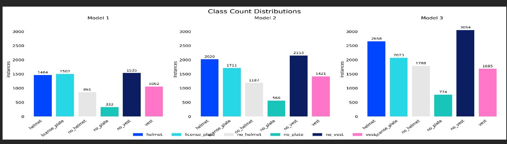

# Synthetic to Street: Generative AI-Powered Object Detection

**Research Implementation for AIPR 2025**  
**Contributors:** John Munoz MSDS, Tom Bukowski MSDS, Dr. Mike Busch PhD

---

## Executive Summary

This repository contains the implementation of an Motorcycle Safety Compliance Object Detection Model. <br>
We developed an automated compliance monitoring system capable of real-time detection of safety violations. <br>
We utilized real-world data as well as synthetic video data generated with `Google’s Veo 2 and Veo 3 models`  <br>


### Key Achievement
- **81% mAP50** accuracy achieved through hybrid synthetic-real data approach
- **86% precision** in detecting safety compliance violations
- **Real-time processing** capability for traffic monitoring systems

---

[](example_gifs/model_results.gif)
<br>
(Video source) <a href="https://panamericana.pe/" target="_blank">Panamericana Television
# Problem Statement

In April of 2025, Peru passed a new law requiring all motorcycle riders to wear certified helmets and reflective vests displaying their license plate numbers.
Manual enforcement presents significant challenges:

- Resource-intensive manual inspections
- Limited scalability for nationwide coverage
- Inconsistent enforcement across regions
- Delayed response to violations

### Our Solution
An automated detection system utilizing synthetic data generation to overcome data challenges while maintaining high accuracy in real-world deployments.

[](example_gifs/dash_exseven.gif)
<br>
(Video source) <a href="https://www.pexels.com/" target="_blank">Pexels</a>


---
## Methodology
### Data Generation Pipeline

We developed three Object Detection Models, each building upon the previous model:

#### Model 1: Text-to-Video Generation
- **148 synthetic videos** generated via text prompts
- **2,220 frames** extracted (15 frames/video)
- **Resolution:** 1280x720 pixels
- **Limitation:** Insufficient visual diversity

[](example_gifs/c.gif) <br>
[](example_gifs/e.gif)


#### Model 2: Image-Enhanced Generation
- **Base:** 2,220 frames from Model 1
- **Enhancement:** 100 videos via image-to-video prompting (10 frames/video)
- **Total Dataset:** 3,210 images
- **Improvement:** Greater scene diversity and realism

<p align="center">
  
  
</p>


<p align="center">
  
  
</p>
(Video source) <a href="https://panamericana.pe/" target="_blank">Panamericana Television
<br>
<br>
(Video source) <a href="https://elcomercio.pe/lima/transporte/gobierno-suspende-obligatoriedad-del-uso-del-chaleco-para-motociclistas-por-60-dias-mtc-seguridad-ciudadana-sicariato-ultimas-noticia/#google_vignette" target="_blank">GEC / Grupo El Comercio</a>


#### Model 3: Hybrid Approach
- **Synthetic Data:** 3,210 images from Models 1&2
- **Real-World Data:** 512 authentic images with augmentation
- **Final Dataset:** 4,234 images
- **Result:** Superior generalization capability


### Class Distribution Analysis

[](example_gifs/class_count.jpg)

## Technical Architecture

### YOLOv8 Configuration
```yaml
# Model Specifications
architecture: YOLOv8l (Large)
pretrained_weights: COCO dataset
input_resolution: 640x640
optimizer: AdamW
learning_rate: 0.001
batch_size: 16
augmentation: True
Platform: Google Colab 
GPU: NVIDIA A100
Training Infrastructure
Epochs: 50 (Models 1&2), 100 (Model 3)
```
## Model Evaluation Results
| Model | Dataset                          | Precision (P) | Recall (R) | mAP50 | mAP50-95 |
|-------|----------------------------------|---------------|------------|-------|----------|
| 1     | Text-to-Prompt (Synthetic only)  | 0.68         | 0.25      | 0.35 | 0.17    |
| 2     | Image-to-Prompt (Synthetic + extra) | 0.74      | 0.57      | 0.64 | 0.31    |
| 3     | Hybrid (Synthetic + Real images) | 0.86         | 0.79      | 0.81 | 0.40    |
<br>


##  Class-Level Performance Improvements

| Class        | Model 1 (Text) mAP50 | Model 2 (Text + Image) mAP50 | Model 3 (Hybrid) mAP50 | Key Observations |
|--------------|----------------|-------------------------|------------------|------------------|
| **Helmet**   | 0.51 | 0.90  |  0.97  |  Large Increase for Model 2,  Best Scores in Model 3. |
| **Vest**     | .40     |     0.78       | 0.94    | Real data in Model 3 enabled strong generalization. |
| **License Plate** | 0.64  | 0.70                 | .90    |   Best performance in Model 3. |
| **No Plate** | 0.00       | 0.36                  | 0.45           |No detection in Model 1, Slight increasein Model 2, Model 3 moderate detection. |
| **No Vest**  | .35       |  .60        | .74          | Model 1 & Model 2 moderate performance, Model 3 performed best. |
| **No Helmet**| .21         |   .47          | .84         | Major increase in performance in Model 3. |

<br>


<table>
  <tr>
    <td align="center" width="50%" valign="top">
      <strong>YOLO Detection Results</strong><br>
      
    </td>
    <td align="center" width="50%" valign="top">
      <strong>Validation Results</strong><br>
      <div style="margin-top:20px;">
        
      </div>
    </td>
  </tr>
  <tr>
    <td align="center" width="50%" valign="top">
      <strong>Confusion Matrix</strong><br>
      
    </td>
    <td align="center" width="50%" valign="top">
      <strong>Precision–Recall Curve</strong><br>
      <div style="margin-top:20px;">
        
      </div>
    </td>
  </tr>
</table>


## Project Structure  

###  Dropbox Exports  
- **Model 1 Text-To-Prompt Video Results/** – Synthetic videos generated using text-to-prompt.  
- **Model 2 Videos Text-To-Image Result/** – Synthetic videos generated using image-to-prompt.  

###  YOLO Model Results  
- **all_model_results.py** – Script to build and evaluate YOLO models.  
- **model-weights.pt** – Trained YOLO weights (from Model 3).  

### Google Drive Datasets  
- **Model 1/** – Images and labels from text-to-prompt.  
- **Model 2/** – Images and labels from text + image-to-prompt.  
- **Model 3/** – Hybrid dataset (synthetic + real-world images).  
- **data.yaml** – YOLO dataset configuration (classes + train/val/test).  

### Pre-Processing  
- **extract_frames.py** – Extracts frames from videos.  
- **split_images.py** – Splits data into train/val/test sets.  
- **image_augmentation.py** – Applies augmentations (scaling, brightness, contrast, etc.).  

### Object Detection on Videos  
- **yolo_model.py** – YOLO inference on custom dataset.  
- **yolo_model_with_coco.py** – YOLO inference using COCO classes for comparison.  

###  Dashboard  
- **finished_dashboard.py** – Streamlit dashboard for visualizing model performance.  

###  Test Examples  
- **test_examples/** – Example images and files used in dashboard + OCR tests.  


##  Data Resources  

### 🎬 Video Results  
- [Model 1 Videos – Dropbox Repository](https://www.dropbox.com/scl/fo/6jhvwh6lq166buio6o4vi/AEEvkHp8TXHU-5OpbtYprX0?rlkey=jvksmrftng7v1hwn3zjlrjxht&st=9fodicvg&dl=0)  
- [Model 2 Videos – Dropbox Repository](https://www.dropbox.com/scl/fo/d743mq5qja5i506v5owju/AJOalYCvmGseXKVF8ZBt3PY?rlkey=v5rj13na571utijm0cvijfnr4&st=oto20wxa&dl=0)  

### 📸 Training Datasets  
- [Model 1 Dataset – Google Drive](https://drive.google.com/drive/folders/1RspvxtjfR8ARrki6Z4j6bzJEoz6eq_Qs?usp=drive_link)  
- [Model 2 Dataset – Google Drive](https://drive.google.com/drive/folders/1kjRnt2KX4i3tZgRLsVXuQiApVCQrmu8b?usp=drive_link)  
- [Model 3 Dataset – Google Drive](https://drive.google.com/drive/folders/17U8tqVlf9sJ-J8u9K8fccjStmTAsFP_4?usp=drive_link)  

---

 **Supporting Script**  
- **all_model_results.py** – Results of building YOLO models in Colab.  


##  Hugging Face Dashboard – Compliance Detector  
[ Live Demo on Hugging Face](https://huggingface.co/spaces/johngmunoz/Motorcycle)

The Compliance Detector is an interactive Streamlit dashboard deployed on Hugging Face Spaces. It provides multiple tabs for video and image-based motorcycle compliance detection.

---

### 🎥 Video Detections  
- **Upload a Video** – Supports MP4, MOV, AVI, MKV (up to 200MB).  
- **Models Available:**  
  - `yolo_custom` – Custom YOLOv8 model (Model 3: Hybrid synthetic + real).  
  - `coco + custom` – First detects motorcycles with COCO, then applies custom compliance model.  
- **Controls:**  
  - **Skip Frames** – Speed vs accuracy trade-off.  
  - **Resize Scale** – Adjusts video input size for faster inference.  
  - **Confidence Slider** – Minimum confidence threshold for detection.  
- **Output:**  
  - Bounding box detections for helmets, vests, license plates, and violations.  
  - Live video preview with adjustable performance settings.  


<br>
(Video source) <a href="https://panamericana.pe/" target="_blank">Panamericana Television <br>
---

###  Image Detections  
- **Upload an Image** – Supports JPG and PNG.  
- **Custom model (.pt)** – Loads trained YOLO model weights.  
- **OCR Options:**  
  1. **License Plate OCR** – Detects riders missing a vest and extracts plate text.  
  2. **Vest OCR** – Detects vest violations and extracts vest number (potential offender tracking).  
- **Controls:**  
  - **Confidence Slider** – Fine-tune detection sensitivity.  
- **Output:**  
  - Detected bounding boxes.  
  - OCR text overlay for license plates or vest IDs.  

<p align="center">
  
  
</p>

<br>
(Video source) <a href="https://panamericana.pe/" target="_blank">Panamericana Television 
<br>
(Video source) <a href="https://www.pexels.com/" target="_blank">Pexels</a> 

---

### Dashboards  
- **No-Vest Detections**  
  - Tracks riders with missing vests in real time.  
  - Links detected riders to license plates.  
  - Displays simple compliance dashboard.  
- **Vest Violations**  
  - Detects individuals committing violations (no vest, altered vest).  
  - OCR extracts vest numbers for potential investigation.  
  - Dashboard summarizing detected non-compliant riders.  
- **Controls:**  
  - **Skip Frames, Resize Scale, Confidence, Update Rate** – Adjust real-time performance.  
- **Output:**  
  - Real-time detection overlay and violation statistics dashboard.  


##  Dashboard Examples  

<p align="center">
  
  
</p>

<p align="center">
  
  
</p>
<br>
<br>
(Video source) <a href="https://panamericana.pe/" target="_blank">Panamericana Television 
<br>
(Video source) <a href="https://www.pexels.com/" target="_blank">Pexels</a> 


---
<br>

> Disclaimer: ALL video data used in this demo was obtained from publicly available sources and is used strictly for non-commerical, educational research purposes. Videos were attained from Panamericana Television  [ Panamericana Televisiob](https://panamericana.pe/) ,(Pexels) <a href="https://www.pexels.com/" target="_blank">Pexels</a> and (Video source) <a href="https://elcomercio.pe/lima/transporte/gobierno-suspende-obligatoriedad-del-uso-del-chaleco-para-motociclistas-por-60-dias-mtc-seguridad-ciudadana-sicariato-ultimas-noticia/#google_vignette" target="_blank">GEC / Grupo El Comercio</a>

